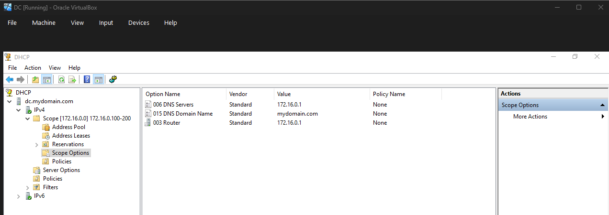
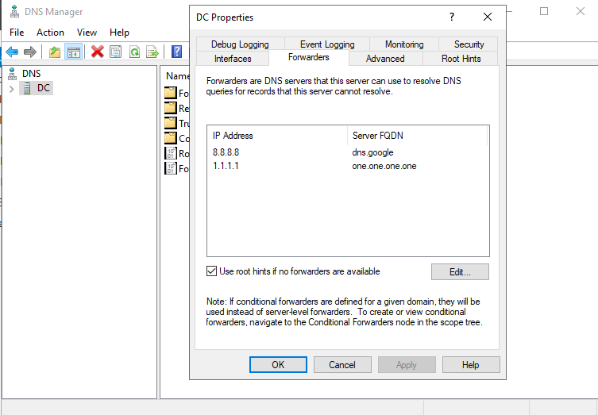
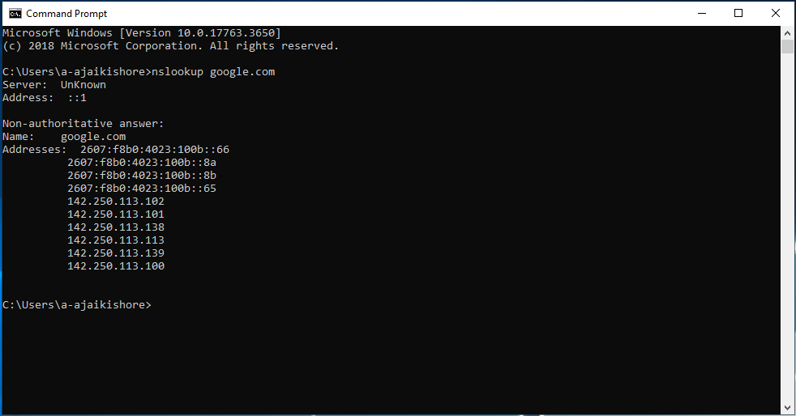
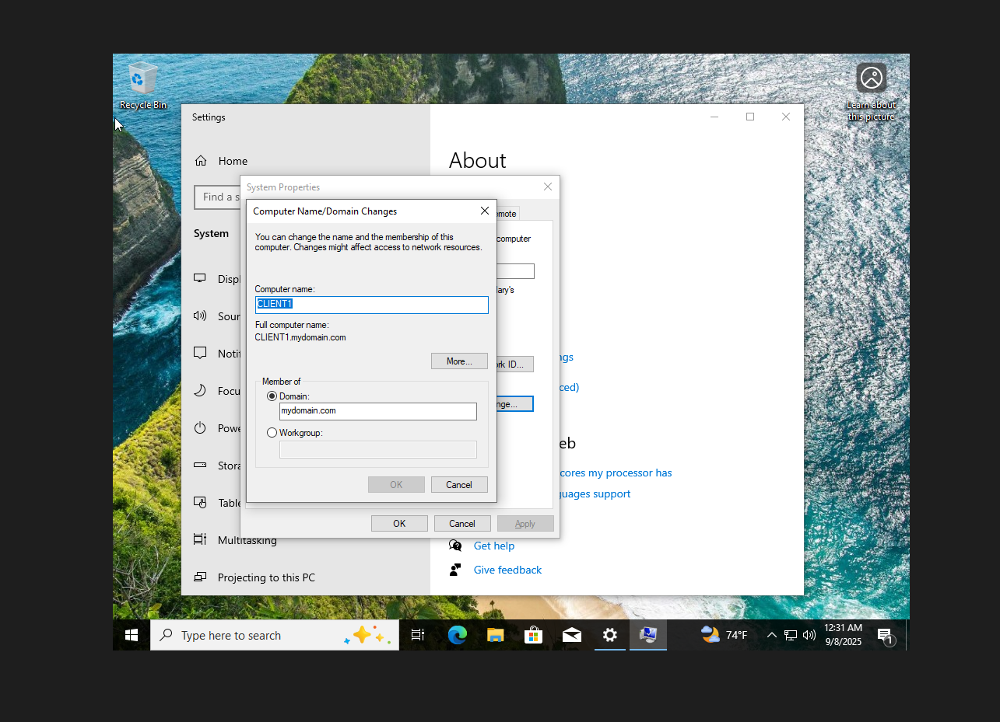
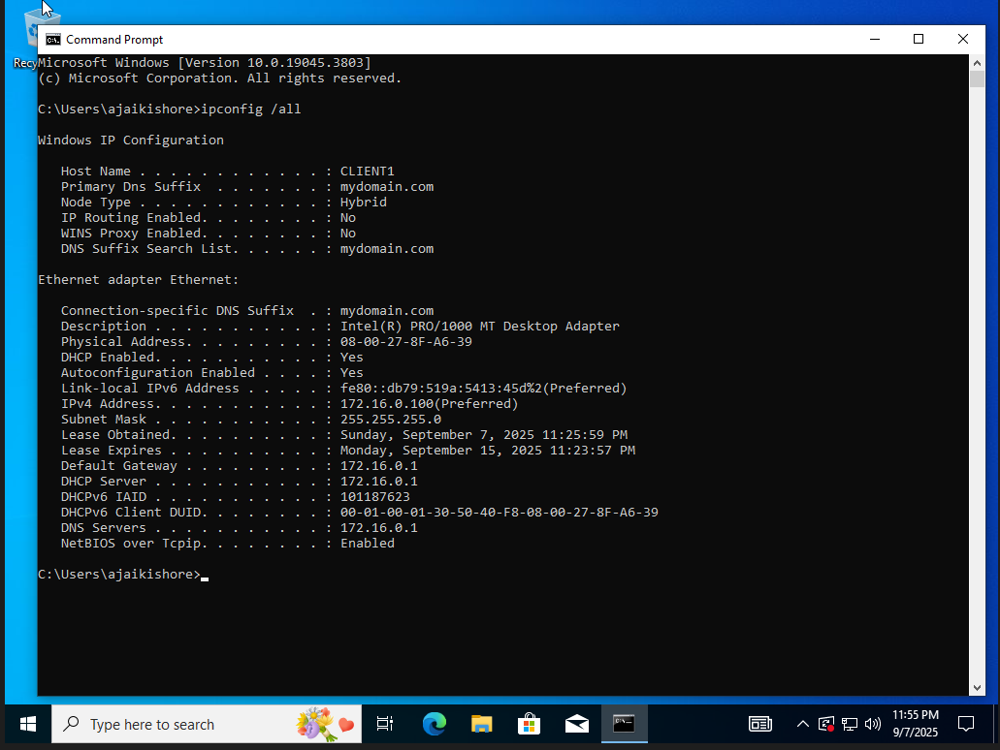
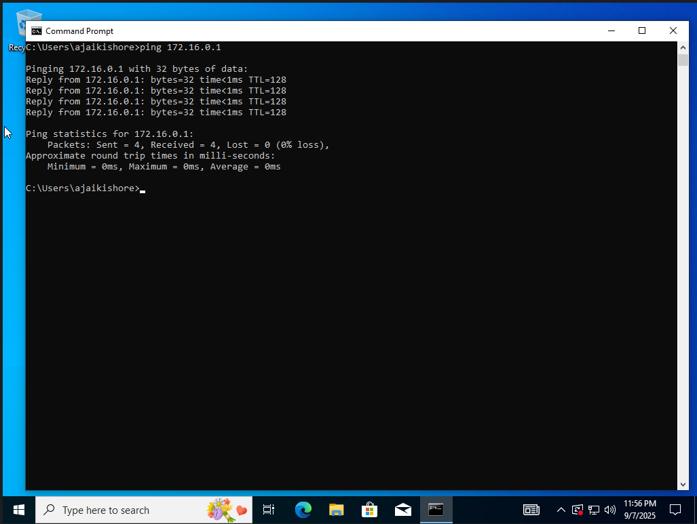
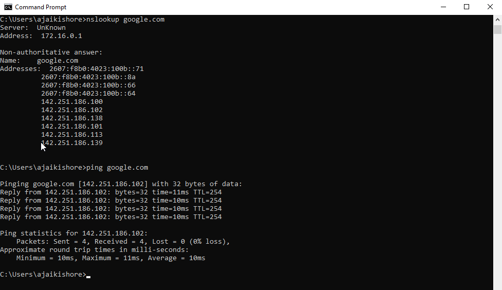
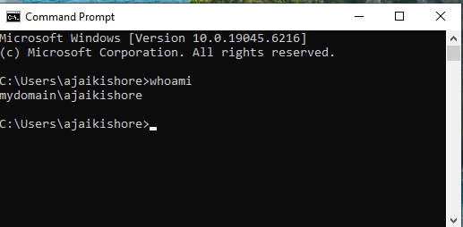

# 📒🌐 Active Directory Home Lab

## Description
This is my Active Directory home lab where I set up a Windows Server 2019 Domain Controller and a Windows 10 client in VirtualBox. I configured AD DS, DNS, and DHCP to mimic how a real corporate network works. I also created a domain (`mydomain.com`), added organizational units, and made user accounts that could log into the client machine. Along the way, I practiced troubleshooting DNS and ensuring domain-joined clients could resolve and access external domains like google.com.

### Technologies Used
- Windows Server 2019  
- Windows 10  
- VirtualBox (NAT + Internal Network)  
- Roles: AD DS, DNS, DHCP  
- Active Directory Users and Computers (ADUC)  

## Walk-through

**1. Promoted the Server to a Domain Controller** – Installed AD DS, created the domain `mydomain.com`, and gave the DC a static IP (`172.16.0.1`).  

**2. Configured DHCP Scope Options** – Set the DC to hand out IP addresses, default gateway, and DNS to clients.  

**3. Set DNS Forwarders** – Configured Google (8.8.8.8) and Cloudflare (1.1.1.1) so external name resolution works.  

**4. Tested DNS on the DC** – Verified that the Domain Controller could resolve google.com using `nslookup`.  

**5. Created Users and Organizational Units** – Added sample accounts in Active Directory Users and Computers (e.g., test users) to simulate how IT teams manage employees.  

**6. Joined the Windows 10 Client to the Domain** – Connected Client1 to `mydomain.com`, then logged in using the domain user profile I created.  

**7. Verified Client IP Settings** – Client1 successfully pulled the correct IP, gateway, and DNS from DHCP.  

**8. Checked Client-DC Connectivity** – Confirmed Client1 could ping the Domain Controller.  

**9. Verified External Connectivity** – Client1 resolved and pinged google.com through the DC’s DNS forwarders.  

**10. Logged in as a Domain User** – Restarted Client1 and logged in with a domain user account created in ADUC.  

## What I Learned
- I learned how to promote a Windows Server to a Domain Controller and create a domain from scratch.  
- I practiced managing users and groups in Active Directory Users and Computers.  
- I saw how DHCP, DNS, and AD all work together to support domain-joined clients.  
- Fixing a DNS misconfiguration through DHCP scope options showed me how important proper configuration is.  
- This lab gave me a hands-on look at how corporate IT environments handle identity, authentication, and network management.  
